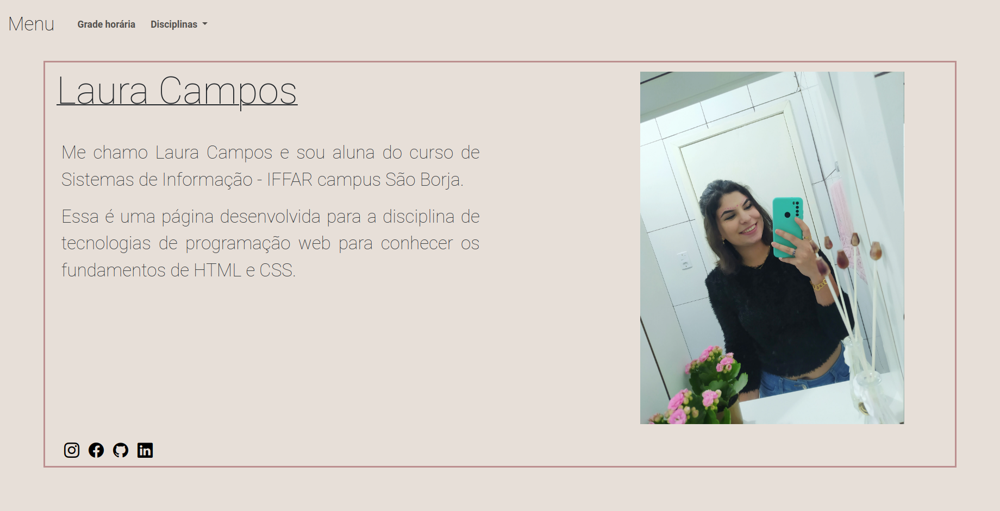

<h1 align="center"> Meu site</h1>

    Atividade desenvolvida na disciplina de tecnologias para programação web do curso de Sistemas de Informação, o objetivo da atividade é desenvolver uma página pessoal para o semestre com HTML e CSS.

  <a href="#-tecnologias">Tecnologias</a>&nbsp;&nbsp;&nbsp;|&nbsp;&nbsp;&nbsp;
  <a href="#-projeto">Projeto</a>&nbsp;&nbsp;&nbsp;|&nbsp;&nbsp;&nbsp;

  

 

  

## 🚀 Tecnologias

Esse projeto foi desenvolvido com as seguintes tecnologias:

- HTML e CSS
- JavaScript
- Git e Github

## 💻 Projeto

Cada disciplina em uma página
Links para as disciplinas em um menu
Quadro de horários

- [Acesse o projeto finalizado, online](https://github.com/laurarcampos/Meu-site)

